# aws-three-tier-web-architecture

This repo is used to build high availability and scalability web applications.

The web architecture consists of three tiers, including web tier (VPC), application tier (EC2) and database tier (RDS).

Section 1 to section 4 desribe the steps and data to bootstrap three tiers manually. Section 5 desribes how to use Terraform to bootstrap the web tier and the application tier.

## References

* AWS General Immersion Day workshop: <https://catalog.us-east-1.prod.workshops.aws/workshops/869a0a06-1f98-4e19-b5ac-cbb1abdfc041/en-US>
* <https://github.com/aws-samples/aws-three-tier-web-architecture-workshop>
* <https://github.com/BJWRD/three-tier-architecture>
* <https://github.com/Emmylong1/terraform-3-tier-webapp>

## The AWS services I used

EC2,VPC,IAM,RDS and Secrets Manager

## The architecture diagram

The below diagram is from the first reference site (AWS General Immersion Day workshop) above. But we use `ap-southeast-1` and `ap-southeast-2` in this project.
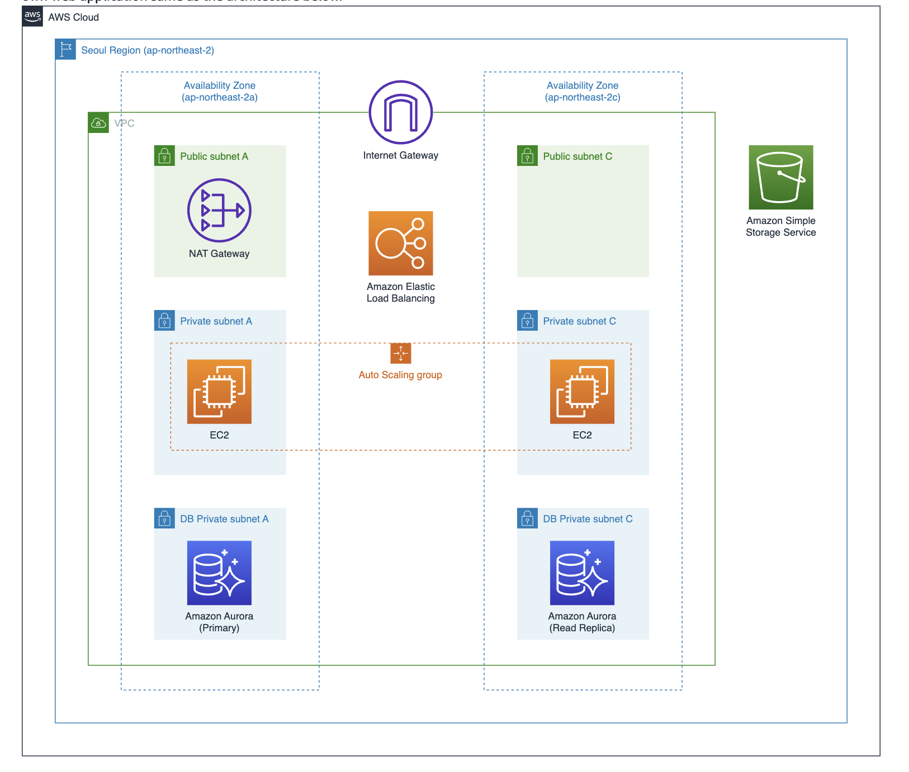

## Prerequisites

* Create a new aws account
* Create an IAM user in the new aws account created above with the details below.
  * User Name: Administrator
  * Custom password: Create your own password
  * Attach policies directly with the policy name called `AdministratorAccess`
* Install Terraform
* Install AWS CLI
* A locally configured AWS profile for the above IAM user `Administrator`
* The following parts are implemented in the IAM user account `Administrator`

## 1. Network - Amazon VPC

* Create a VPC in the region `Asia Pacific (Sydney)` with the following details.
  * Name: VPC-Lab
  * IPv4 CIDR block: `10.0.0.0/16`
  * Availability Zones: 2
  * Customize AZs: `ap-southeast-2a` and `ap-southeast-2c`
  * Number of public subnets: 2
  * Number of private subnets: 2
  * Customize subnets CIDR blocks with the following values.
  
    |         KEY                   |   VALUE           |
    | :---------------------------: |:-----------------:|
    | 2a Public subnet's IPv4 CIDR  | 10.0.10.0/24      |
    | 2c Public subnet's IPv4 CIDR  | 10.0.20.0/24      |
    | 2a Private subnet's IPv4 CIDR | 10.0.100.0/24     |
    | 2c Private subnet's IPv4 CIDR | 10.0.200.0/24     |
  * NAT gateways: In 1 AZ
  * VPC endpoints: None
  * DNS options: Enable DNS hostnames and Enable DNS resolution
  
## 2. Compute - Amazon EC2

### 2.1 Launch a web instance and execute user data

Create a new EC2 instance with the details below

* Name: Web server for custom AMI
* Amazon Machin Image: Amazon Linux AWS (by default) and select `Amazon Linux 2023 AMI`
* Architecutre: 64-bit (x86)
* Instance type: t2.micro
* Key pair name: Proceed without a key pair
* VPC: VPC-Lab-vpc
* Subnet: VPC-Lab-subnet-public1-ap-southeast-2a
* Auto-assign Public IP: Enable
* Create a security group with the following details.
  * Security group name: `Immersion Day - Web Server`
  * Description: Immersion Day - Web Server
  * Add security group rule in the inbound rules: set HTTP to Type. Allow TCP/80. Select 0.0.0.0/0 for the Custom source type.
  * Advanced details (Meta Data versions): V2 only (token required)
  * User data

   ```bash script
    #!/bin/sh
    ​
    #Install a LAMP stack
    dnf install -y httpd wget php-fpm php-mysqli php-json php php-devel
    dnf install -y mariadb105-server
    dnf install -y httpd php-mbstring
    ​
    #Start the web server
    chkconfig httpd on
    systemctl start httpd
    ​
    #Install the web pages for our lab
    if [ ! -f /var/www/html/immersion-day-app-php7.zip ]; then
    cd /var/www/html
    wget -O 'immersion-day-app-php7.zip' 'https://static.us-east-1.prod.workshops.aws/public/dd38a0a0-ae47-43f1-9065-f0bbcb15f684/assets/immersion-day-app-php7.zip'
    unzip immersion-day-app-php7.zip
    fi
    ​
    #Install the AWS SDK for PHP
    if [ ! -f /var/www/html/aws.zip ]; then
    cd /var/www/html
    mkdir vendor
    cd vendor
    wget https://docs.aws.amazon.com/aws-sdk-php/v3/download/aws.zip
    unzip aws.zip
    fi
    ​
    # Update existing packages
    dnf update -y

   ```

* Create a new IAM role with the following details below
  * Trusted entity type: AWS service
  * service or use case: EC2
  * permission policy: `AmazonSSMManagedInstanceCore`
  * role name: `SSMInstanceProfile` 
* Attach the IAM role created above to the new instance `Web server for custom AMI` created above

* Verify whether the new EC2   instance has been created successfully.
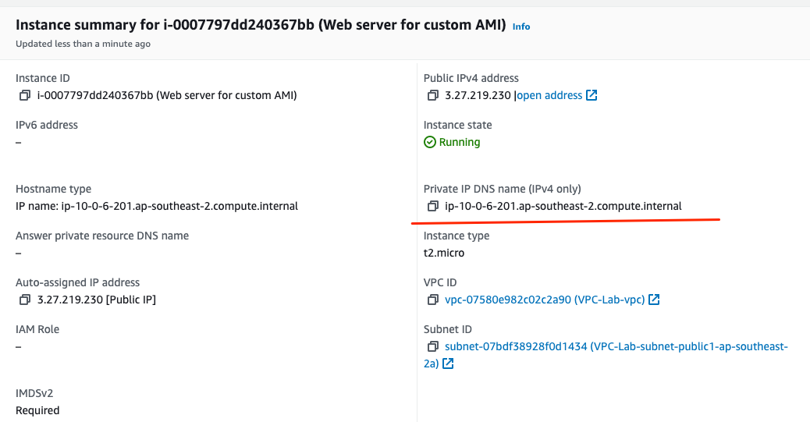

* Choose the new EC2 instance, and then `EC2 Instance Connect` , run `ls -al` and then `df`. The result will be like the following screenshot.
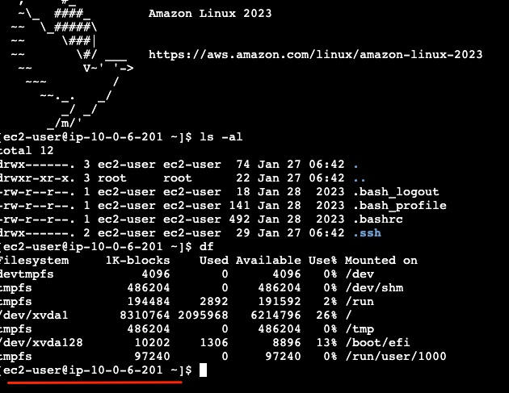
  
### 2.2 Create a custom Amazon Machine Image (AMI)

In the EC2 console,select the instance that we created earlier in the step 2.1 above, click Actions > Image and templates > Create Image

* image name: Web Server v1
* image description: LAMP web server AMI

You can see the new AMI has been successfully created.
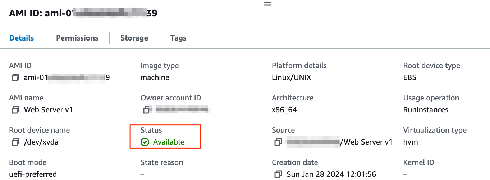

  
### 2.3 Launch an Applcation Load Balancer (ALB)

Create a target group with the following details.

* target type: Instances
* target group name: web-TG
* VPC: VPC-Lab-vpc

Create an appllication load balancer with the following details.

* load balancer name: Web-ALB
* VPC: VPC-Lab-vpc
* Subnets: VPC-Lab-subnet-public1-ap-southeast-2a and VPC-Lab-subnet-public2-ap-southeast-2c
* Create a new security group with the details below and attach it to the ALB. Remove the default security group.
  * security group name: `web-ALB-SG`
  * description: web-ALB-SG
  * VPC: VPC-Lab-vpc
  * Add an inbound rule with http type and Anywhere-IPv4 as the source
* Listeners and routing: Use the target group `web-TG` created above.
  
### 2.4 Configure a Launch Template

Create a security group with the followig details.

* Security group name: `ASG-Web-Inst-SG`
* Description: HTTP Allow
* VPC: VPC-Lab-vpc
* Add an inbound rule with the Type HTTP and the security group `web-ALB-SG`. This will configure the security group to only receive HTTP traffic coming from ALB.

Create a launch template with the following details.

* launch template name: web
* template version description: Immersion Day Web Instances Template - Web only
* Auto scaling guidance: Cick the checkbox `Provide guidance to help me set up a template that I can use with EC2 Auto Scaling`
* AMI: Web Server v1 which was created in 2.2 above
* instance type: t2.micro
* security group: ASG-Web-Inst-SG
* Create a resouce type with the following details.
  
|      KEY       |      VALUE            |
| :------------: |:---------------------:|
| Key            | Name                  |
| Value          | Web Instance          |
| Resource types | Instances and Volumes |

* IAM instance profile: `SSMInstanceProfile`

### 2.5 Configure an Auto Scaling Group

Create an Auto Scaling Group with the following details.

* Name: Web-ASG
* Launch template: web
* VPC: VPC-Lab-vpc
* Availability zones and subnets: `VPC-Lab-subnet-private1-ap-southeast-2a` and `VPC-Lab-subnet-private2-ap-southeast-2c`
* Attach to an existing load balancer: select existing load balancer target groups `web-TG`
* Monitoring: click on the checkbox `Enable group metrics collection within CloudWatch`
* Desired capacity: 2
* Minimum capacity: 2
* Maximum capacity: 4
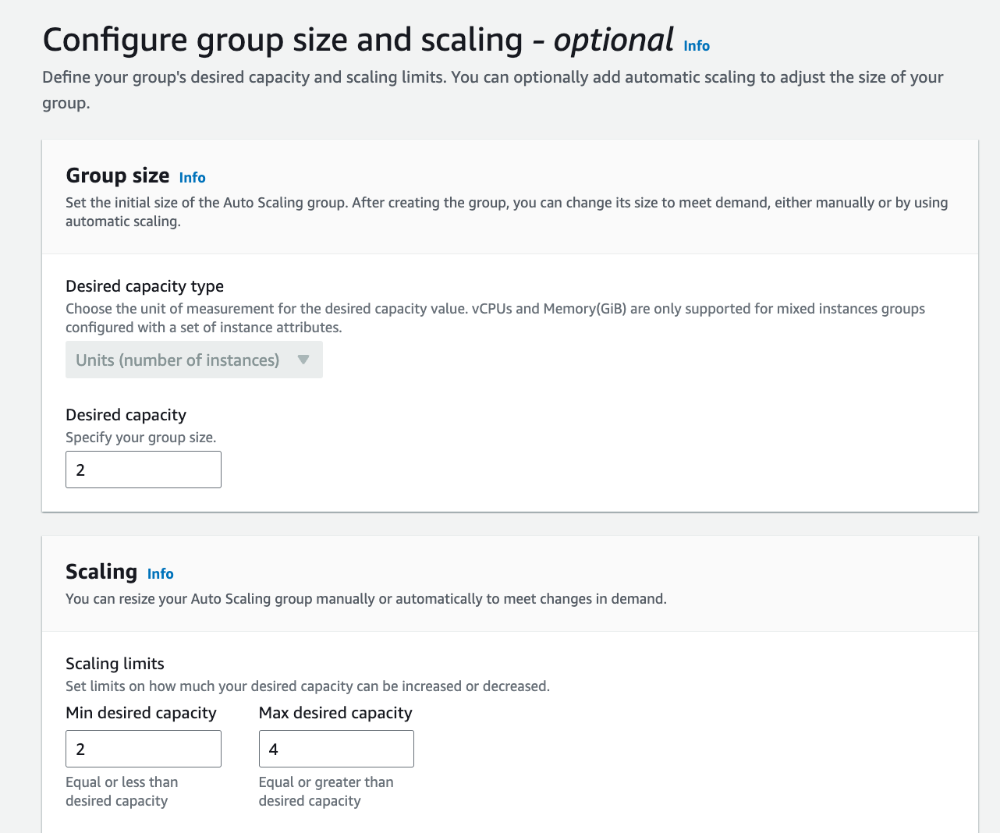
* Scaling policy name: Tracking policy
* metric type: average CPU utilization
* target value: 20
* instance warmup: 60 seconds
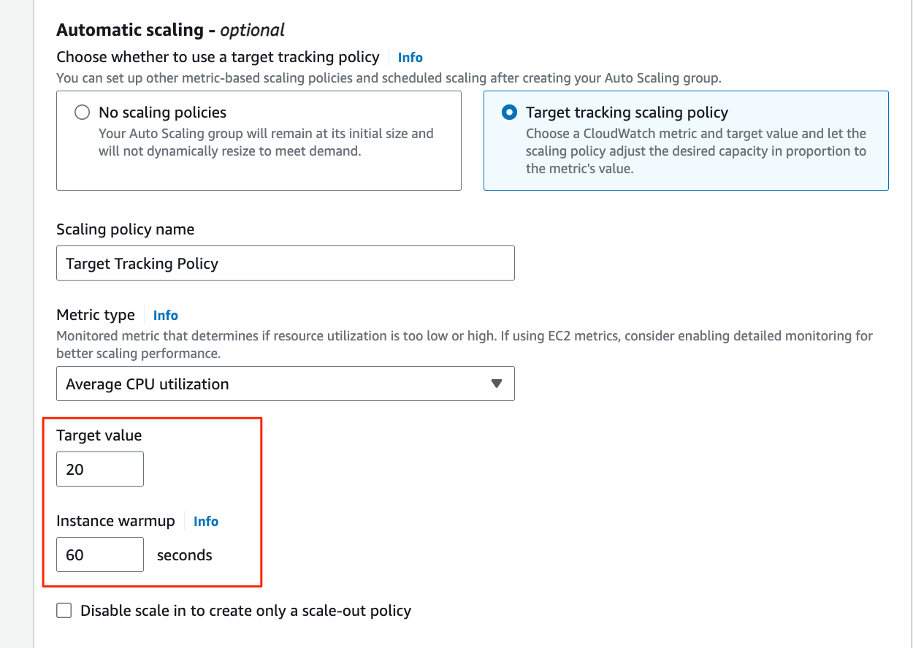
* Create a tag: type `Name` in Key, `ASG-Web-Instance` in Value
* health check: 120 seconds

Verify whether two EC2 instances have been created successfully after the ASG is created.
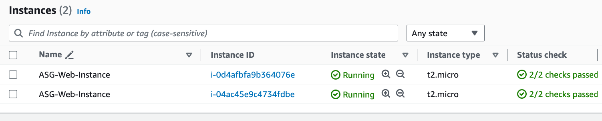

### 2.6 Test auto scaling and change manual settings

* Open the application load balancer `Web-ALB`. Copy DNS name and open it in the web broswer. You will notice the web page points to the availability zone `ap-southeast-2a`.
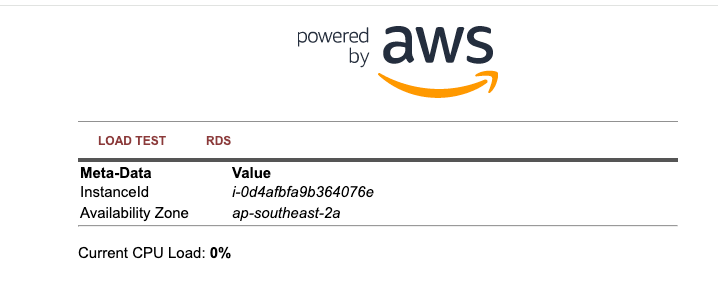

Refresh the page a few times and you will notice the web page reflects in a different availability zone `ap-southeast-2c`.


* Click on 'LOAD Test' button from the page
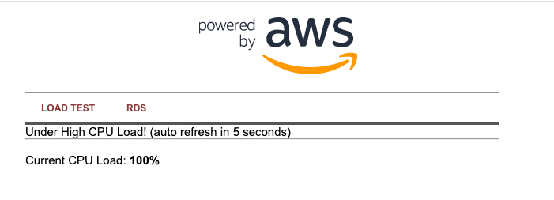
* Wait for 2 mins (120 seconds) and click the Activity tab to see the additional EC2 instances deployed according to the scaling policy.
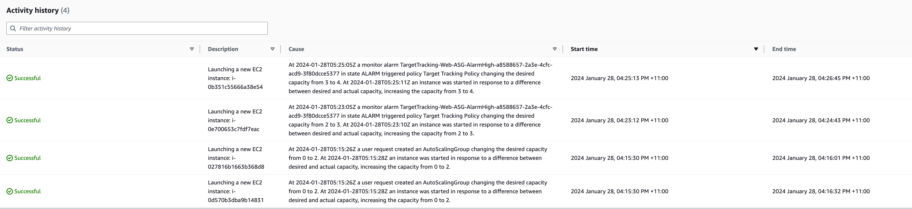

## 3. Database - Amazon Aurora

### 3.1 Create a VPC security group

Create a security group with the following details.

* security group name: `DB-SG`
* description: Database security group
* vpc: VPC-Lab-vpc
* inbounde rule type: MYSQL/Aurora
* inbound rule security group: ASG-Web-Inst-SG  

### 3.2 Create a RDS instance

Create a RDS instance with the following details.

* database creation method: standard create
* engine type: Aurora (MySQL Compatible)
* edition: Aurora (MySQL 3.04.1)
* templates: Production
* DB cluster identifier: rdscluster
* Master username: awsuser
* Master password: awspassword
* DB instance class: db.r5.large
* VPC: VPC-Lab-vpc
* security group: DB-SG
* initidal database name: immersionday
* DB cluster parameter group: default.aurora-mysql8.0
* DB parameter group: default.aurora-mysql8.0

### 3.3 Storing RDS Credentials in AWS Secrets Manager

Create a secret with the following details.

* secret type: credentials for Amazon RDS database
* user name: awsuser
* password: awspassword
* database: rdscluster
* secret name: mysecret
* retrieve secret value and add the following key and value.

|      KEY       |      VALUE            |
| :------------: |:---------------------:|
| Key            | dbname                |
| Value          | immersionday          |

### 3.4 Access RDS from EC2

Create a new policy via AWS IAM with the following details.

* service: Secrets Manager
* access level: Read and then check the box `GetSecretValue`
* resources: All resources
* policy name: `ReadSecrets`
* Attach the policy to the existing IAM role `SSMInstanceProfile`

Verify whether ECS instances are able to connect to RDS

* Open the application load balancer created above and copy the DNS name and paste it to a browser
* Open the browser and click on RDS
* Now you can check the data in the datavase you created
* Click on `Add Contact` link, and add a new record. The result will look like the following screenshot.
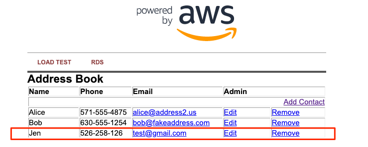

## 4. Clean up resources

### 4.1 Database

* Delete the Writer instance `rdscluster-instance-1`
* Delete the Reader instance `rdscluster-instance-1-ap-southeast-2a`
* Delete the DB Cluster `rdscluster`

### 4.2 Secrets

* Delete the secret `mysecret`

### 4.3 EC2

* Delete the ASG `WEB-ASG` so all its associated EC2 instances will be deleted
* Delete the first instance `Web server for custom AMI`
* Delete the application load balancer `Web-ALB`
* Delete the target group `web-TG`
* Delete the EC2 AMI `Web Server v1`
* Delete the snapshot which is associated with the EC2 AMI `Web Server v1`
* Delete the launch template `web`

### 4.4 Network

* Delete the NAT gateway `VPC-Lab-nat-public-xxx`
* Delete the elastic IP what the NAT gateway above used
* Delete the security groups in the following order
  * Immersion Day - Web Server
  * DB-SG
  * ASG-Web-Inst-SG
  * web-ALB-SG
* Delete the VPC `VPC-LAB-vpc`

### 4.5 IAM

* Delete the IAM role `SSMInstanceProfile`
* Delete the IAM policy `ReadSecrets`

## 5. Use Terraform to bootstrap the web tier and the application tier

### 5.1 Initialise the TF directory

```terraform
 terraform init

```

### 5.2 Create an execution plan

```terraform
 terraform plan
 
```

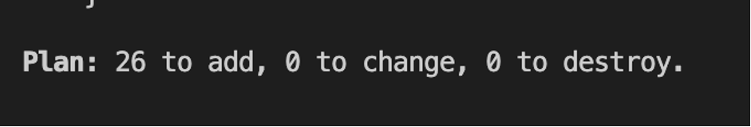

### 5.2 Execute terraform configuration

```terraform
 terraform apply --auto-approve
 
```

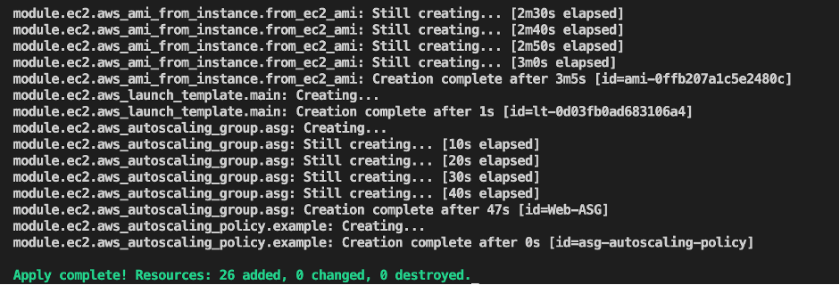

### 5.3 Verification steps

#### VPC verification

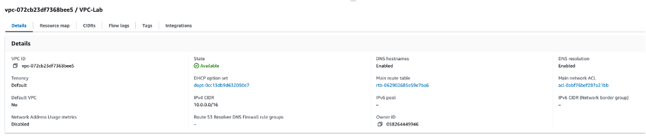

#### EC2 verification before the load test

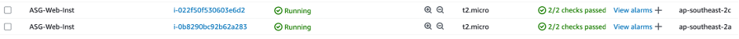

#### ASG verification before the load test

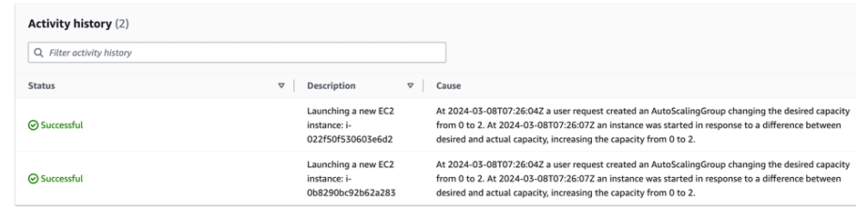

#### Load Balancer verification

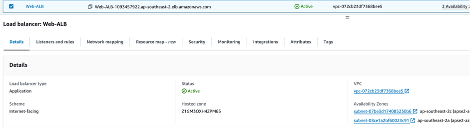

#### UI verification before the load test

Open a new tab in your web browser and paste the copied DNS name. You can see that web service is working as shown below. For the figure below, you can see that the web instance placed in ap-northeast-2a is running this web page.
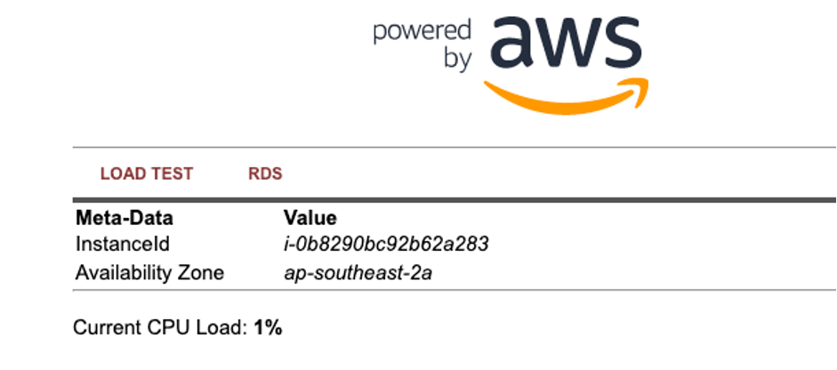

If you click the refresh button here, you can see that the host serving the web page has been replaced with an instance of another availability zone area (ap-southheast-2c) as shown below.
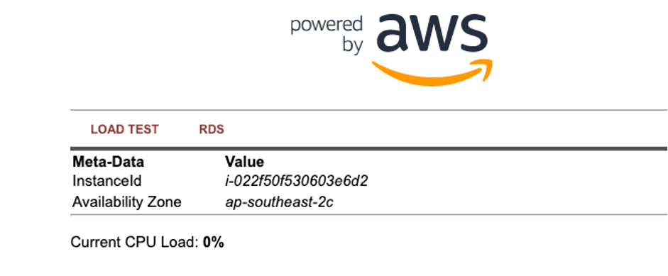

#### EC2 verification after the load test

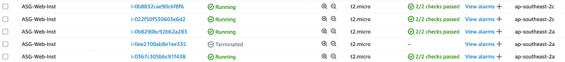

#### ASG verification after the load test

You can see the number of the EC2 instances have been increased from 2 to 4 after the load test.
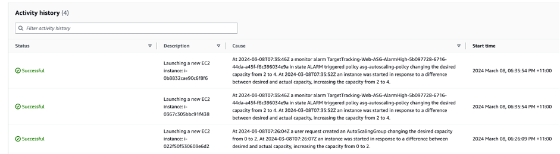

### 5.4 Cleanup resources

```terraform
 terraform destroy
 
```

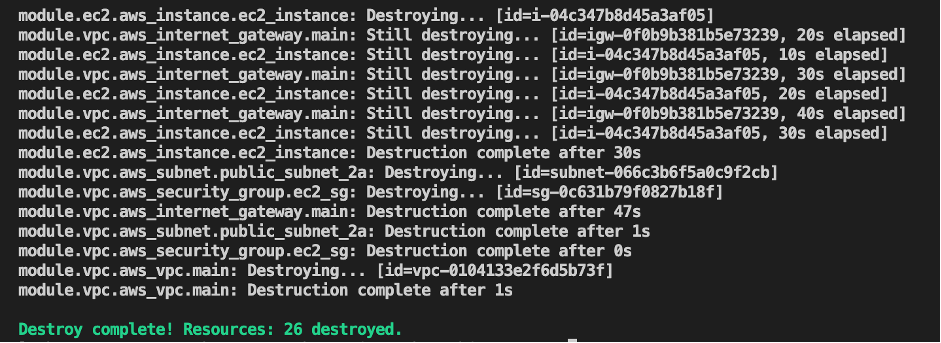

### 5.5 Misc

#### Requirements

| Name          | Version       |
| ------------- |:-------------:|
| terraform     | >= 1.0        |
| aws           | >= 4.50.0     |

#### Providers

| Name          | Version       |
| ------------- |:-------------:|
| aws           | >= 4.50.0     |

#### Modules

vpc ane ec2

#### Resources

| Name          | Type       |
| ------------- |:-------------:|
| aws_vpc | resource |
| aws_subnet | resource |
| aws_internet_gateway | resource |
| aws_eip | resource |
| aws_nat_gateway | resource |
| aws_route_table | resource |
| aws_route_table_association | resource |
| aws_security_group| resource |
| aws_instance | resource |
| aws_ami_from_instance | resource |
| aws_lb| resource |
| aws_lb_listener| resource |
| aws_lb_target_group| resource |
| aws_launch_template | resource |
| aws_autoscaling_policy | resource |
| aws_autoscaling_group | resource |
