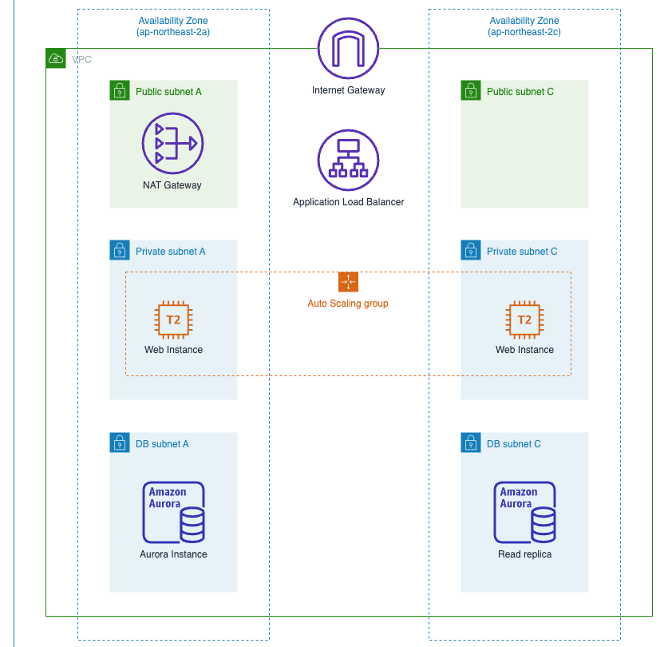

# aws-three-tier-web-architecture

This repo is used to build high availability and scalability web applications.

It consists of three tiers, including web tier, applicatio tier and database tier. 

## References

* AWS General Immersion Day workshop: <https://catalog.workshops.aws/general-immersionday/en-US>
* <https://github.com/aws-samples/aws-three-tier-web-architecture-workshop>

## The AWS services I used

EC2,VPC,IAM,Cloud Watch, RDS, S3

## The architecture diagram

The below diagram is from the first reference site (AWS General Immersion Day workshop) above

## 1. Network - Amazon VPC

## 2. Compute - Amazon EC2

## 3. Database - Amazon Aurora

## 4. Storage - Amazon S3

## 5. Clean up resources

